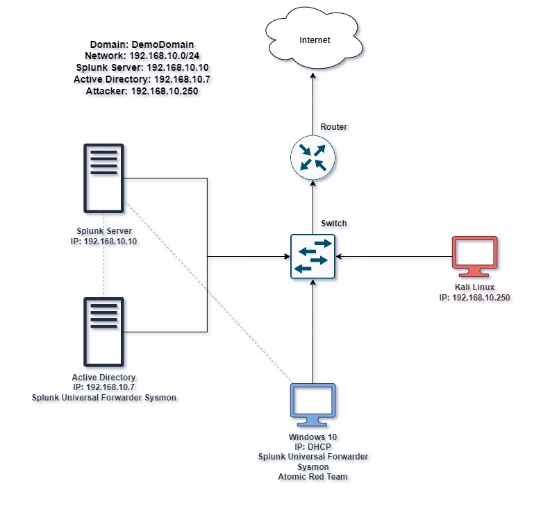

# Active Directory Cybersecurity 

## Overview
This project involves building a comprehensive virtual cybersecurity lab using Oracle VM VirtualBox. The lab includes Windows 10, Kali Linux, Windows Server 2022, and Ubuntu Server VMs, each configured on a shared NAT network. The goal is to simulate a secure enterprise environment with log monitoring, endpoint detection, domain management, and security testing.

The lab integrates advanced tools such as Splunk for log analysis, Sysmon for deep system monitoring, and Universal Forwarder for log forwarding. Attack simulations are conducted using Crowbar and Atomic Red Team (ART), while PowerShell is used for automation. Remote Desktop is enabled on Windows machines, and all systems are joined to an Active Directory domain.

  
*Figure 1: Active Directory Lab Architecture*

---

## Objectives
- Set up and configure a multi-VM cybersecurity lab environment.
- Practice system administration, log collection, and endpoint monitoring.
- Deploy and analyze results from security testing tools.
- Automate administrative tasks using PowerShell scripting.

This hands-on experience enhances foundational skills in cybersecurity, virtualization, system configuration, network administration, and security operations.

---

## Skills Acquired
- VM setup in Oracle VM VirtualBox (Windows, Linux distributions)
- NAT networking configuration and IP addressing
- Splunk Enterprise deployment and log collection via Universal Forwarder
- Sysmon installation for detailed endpoint event monitoring
- Security testing using Crowbar and Atomic Red Team
- Active Directory domain creation and management
- Remote Desktop configuration and troubleshooting
- PowerShell automation and scripting

---

## Tools and Technologies
- **Oracle VM VirtualBox**: Virtualization platform
- **Windows 10 & Server 2022**: Target and domain controller
- **Kali Linux**: Attacker machine
- **Ubuntu Server (22.04.4 LTS)**: Splunk Server host
- **Splunk Enterprise**: Centralized log analysis platform
- **Splunk Universal Forwarder**: Forwards logs from endpoints
- **Sysmon (System Monitor)**: Monitors endpoint-level events
- **Crowbar**: Brute-force attack tool
- **Atomic Red Team (ART)**: Adversary simulation framework
- **PowerShell**: Used for configuration scripting

---

## Phase 1: Virtual Machine Setup

### 1. Install Oracle VM VirtualBox
Download from https://www.virtualbox.org/. Install the software with all necessary extensions.

### 2. Install Guest Operating Systems
#### a. **Windows 10**
- Download Windows 10 ISO from Microsoft's official site https://www.microsoft.com/en-ca/software-download/windows10.
- Allocate: 4096MB RAM, 1 CPU, 50GB disk
- Boot from ISO and follow standard installation steps.

#### b. **Kali Linux**
- Download the Kali VM image from https://www.kali.org/
- Extract using 7-Zip and import into VirtualBox.

#### c. **Windows Server 2022**
- Download ISO from Microsoft Evaluation Center https://www.microsoft.com/en-us/evalcenter/evaluate-windows-server-2022.
- Allocate: 4096MB RAM, 1 CPU, 50GB disk
- Install Desktop Experience version.

#### d. **Ubuntu Server**
- Download from https://ubuntu.com/server (v22.04.4 LTS)
- Allocate: 8192MB RAM, 2 CPUs, 100GB disk
- Install and update system:  
  `sudo apt-get update && sudo apt-get upgrade -y`

---

## Phase 2: Networking Configuration

### 1. Create NAT Network in VirtualBox
- Tools > Network > NAT Networks > New
- Configure IP range (e.g., 192.168.10.0/24)
- Attach each VM to this NAT Network

### 2. Assign Static IPs
**Ubuntu (Splunk Server)**:
Edit the file -> sudo nano /etc/netplan/00-installer-config.yaml:
```yaml
network:
  version: 2
  ethernets:
    enp0s3:
      dhcp4: no
      addresses: [192.168.10.10/24]
      nameservers:
        addresses: [8.8.8.8]
      routes:
        - to: default
          via: 192.168.10.1
```
Run: sudo netplan apply
```bash

```
## Phase 3: components installation and setup

### Install Splunk on Ubuntu Server

```
1. Download the `.deb` package from Splunk's website or use `wget` to grab the link directly.
2. Transfer it to your Ubuntu server (via shared folder or `wget`) and install:

sudo dpkg -i splunk*.deb
cd /opt/splunk/bin
sudo ./splunk start
sudo ./splunk enable boot-start -user splunk

Make sure the user splunk exists. If not, create it with:

sudo adduser splunk

```

**Windows 10 (Target-PC)**:
---

## 1. Rename the Computer

- Open the **Start Menu**, search for **"About"**, and open the system settings.
- Click on **"Rename this PC"**.
- Rename it to `target-PC`.
- Restart the system to apply the changes.

---

## 2. Assign Static IP Address

- Press `Win + R`, type `ncpa.cpl`, and hit Enter to open network adapters.
- Right-click the active adapter > **Properties**.
- Select **Internet Protocol Version 4 (TCP/IPv4)** > **Properties**.
- Choose **Use the following IP address** and enter:

  ```
  IP Address:      192.168.10.100
  Subnet Mask:     255.255.255.0
  Default Gateway: 192.168.10.1
  Preferred DNS:   8.8.8.8
  ```

- Apply the settings and confirm changes.
- Open Command Prompt and run:

  ```bash
  ipconfig
  ```

  to verify the new IP address.

---

## 3. Verify Access to Splunk Server

- Open a browser and go to:

  ```
  http://192.168.10.10:8000
  ```

- You should see the Splunk Web login page if the server is running.

---

## 4. Install Splunk Universal Forwarder

- Go to [splunk.com](https://www.splunk.com/).
- Navigate to:

  ```
  Products > Free Trials & Downloads > Universal Forwarder
  ```

- Download the installer that matches your system architecture (32/64-bit).
- Run the installer:
  - Skip setting a password.
  - Do not enable deployment server.
  - For **Receiving Indexer**, use:

    ```
    Host: 192.168.10.10
    Port: 9997
    ```

- Complete the installation.

---

## 5. Install and Configure Sysmon

### Step A: Download Tools

- Download Sysmon:  
  [https://learn.microsoft.com/en-us/sysinternals/downloads/sysmon](https://learn.microsoft.com/en-us/sysinternals/downloads/sysmon)

- Go to:  
  [https://github.com/olafhartong/sysmon-modular](https://github.com/olafhartong/sysmon-modular)

- Scroll to `sysmonconfig.xml`, click **Raw**, then right-click > **Save As**.

### Step B: Install Sysmon

- Extract the Sysmon archive.
- Open **PowerShell as Administrator**.
- Navigate to the extracted Sysmon folder:

  ```powershell
  cd "C:\Path\To\Sysmon"
  ```

- Run the following command to install with the config:

  ```powershell
  .\Sysmon64.exe -i ..\sysmonconfig.xml
  ```

- Accept the license agreement when prompted.

---

## 6. Configure Splunk Forwarder Inputs

- Open **Notepad as Administrator**.
- Create a new file named `inputs.conf` and paste the following:

```
[WinEventLog://Application]
index = endpoint
disabled = false

[WinEventLog://Security]
index = endpoint
disabled = false

[WinEventLog://System]
index = endpoint
disabled = false

[WinEventLog://Microsoft-Windows-Sysmon/Operational]
index = endpoint
disabled = false
renderXml = true
source = XmlWinEventLog:Microsoft-Windows-Sysmon/Operational
```
```
  you should put the inputs.conf in this folder C:\Program Files\SplunkUniversalForwarder\etc\system\local
```
---

#  Windows Server 2022 (ADDC01) Setup Checklist

>  Follow the same steps as the Windows 10 (target-PC) setup. Below are the actions to perform on this server.

---

##  Configuration Steps

1. **Rename the Computer**
   - Set the hostname to `ADDC01`
   - Restart the system to apply changes

2. **Assign a Static IP Address**
   - Use the following configuration:
     ```
     IP Address:      192.168.10.7
     Subnet Mask:     255.255.255.0
     Default Gateway: 192.168.10.1
     Preferred DNS:   8.8.8.8
     ```

3. **Verify Access to Splunk Server**
   - Open browser and go to:
     ```
     http://192.168.10.10:8000
     ```
   - Ensure the Splunk Web UI is accessible

4. **Install Splunk Universal Forwarder**
   - Download from [Splunk Official Site](https://www.splunk.com/en_us/download/universal-forwarder.html)
   - During installation:
     - Skip deployment server
     - Set receiving indexer: `192.168.10.10:9997`

5. **Install and Configure Sysmon**
   - Download Sysmon from Microsoft Docs
   - Use [sysmon-modular config](https://github.com/olafhartong/sysmon-modular)
   - Install using:
     ```powershell
     .\Sysmon64.exe -i sysmonconfig.xml
     ```

6. **Configure Splunk Forwarder Inputs**
   - Create and save `inputs.conf` with required event logs
   - Place the file in:
     ```
     C:\Program Files\SplunkUniversalForwarder\etc\system\local
     ```

---

 Once completed, logs from `ADDC01` will be forwarded to your Splunk server successfully.

---

## Phase 4: Active Directory and Control Domain
---

## 🛠️ 1. Setup Active Directory Domain Services on Windows Server (ADDC01)

### 🪟 Add the AD DS Role

1. Open **Server Manager**.
2. Navigate to:  
   `Manage` → `Add Roles and Features`.
3. Proceed through the wizard:
   - Click **Next** until you reach the "Server Roles" section.
   - Check **Active Directory Domain Services**.
   - When prompted, click **Add Features**.
   - Continue clicking **Next** until the **Install** button becomes available.
   - Click **Install**.

> 📌 Once installation completes, you’ll see the message:  
> `"Configuration required. Installation succeeded on ADDC01."`

---

### 👑 Promote to Domain Controller

1. Click the **flag icon** at the top of Server Manager.
2. Select **"Promote this server to a domain controller"**.
3. Choose:
   - **Add a new forest**
   - **Root domain name**: `demodomain.local`
4. On the Domain Controller Options screen:
   - Leave all defaults checked
   - Create a **DSRM password** (Directory Services Restore Mode)
5. Proceed through the wizard:
   - Let the system validate prerequisites
   - Click **Install**

> 🔄 The server will automatically reboot.  
> 🧑‍💻 After reboot, the login screen should show:  
> `DEMODOMAIN\Administrator`

---

### 🧍 Create OUs and Users in Active Directory

1. In **Server Manager**, go to:  
   `Tools` → `Active Directory Users and Computers`
2. Right-click on `demodomain.local` → `New` → `Organizational Unit`
   - Name: `IT`
3. Right-click the **IT** OU → `New` → `User`
   - First Name: `Jenny`
   - Last Name: `Smith`
   - Full Name: `Jenny Smith`
   - User Logon Name: `jsmith`
   - Set a password
4. Repeat the process:
   - Create another OU called **HR**
   - Add a new user under HR with different credentials

---

## 💻 2. Join Windows 10 Machine to the Domain

1. On the **Windows 10 (target-PC)**:
   - Open **Start Menu** → Search: `Advanced System Properties`
   - Click **Change Settings** under **Computer Name**
   - Click **Change...** and check **Domain:**
     - Enter: `DEMODOMAIN.LOCAL`

2. Configure DNS:
   - Right-click the **Network icon** in system tray → Open **Network & Internet Settings**
   - Click: `Change adapter options`
   - Right-click active adapter → `Properties`
   - Select: **Internet Protocol Version 4 (TCP/IPv4)** → `Properties`
     - Set **Preferred DNS server** to: `192.168.10.7`

3. Verify DNS Settings:
   ```cmd
   ipconfig /all
4. Login to the Domain:
   - Reboot the machine
   -  When you go to login, select "Other User", and verify the domain the login is pointing to is "DEMODOMAIN". Login using the credentials of a user you created 
   earlier under the IT or HR organizational unit.
   


*Build. Monitor. Defend.*

